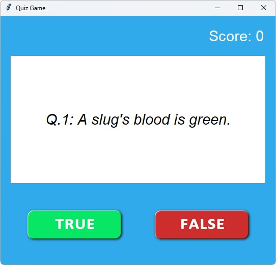

# Quiz Game (using Python & Tkinter)
An interactive, GUI-based quiz game built with Python using the Tkinter GUI toolkit and Pillow for image processing. The game presents True/False trivia questions and tracks the user's score. This project was built as part of my Python development coursework to demonstrate object-oriented programming, event-driven GUI design, and data-driven functionality.



## 💡 Features

- GUI built with **Tkinter** and styled for clarity
- Displays trivia questions dynamically
- Accepts **True/False** answers via custom image buttons
- Tracks and displays score in real-time
- Automatically shows final score at the end
- Modular design with separate files for logic, data, and UI

## 🛠️ Technologies Used

- **Python 3**
- **Tkinter** (GUI)
- **Pillow** (image handling)
- **Object-Oriented Programming**
- **Custom class modules** (`QuizBrain`, `Question`, `data.py`)

<!-- ## 🚀 What I Learned / Practiced

- Building GUI applications with **Tkinter**
- Structuring Python programs using **OOP principles**
- Using external data to populate the app dynamically
- Implementing basic game logic and event handling
- Creating reusable code modules for maintainability -->

## 📁 Project Structure
```
quiz-game-tkinter/
├── main.py # GUI and game loop
├── question_model.py # Question class
├── quiz_brain.py # Game logic class
├── data.py # Question data
├── images/ # True/False button images
├── README.md
```

## 📷 Screenshots


## Getting Started
Follow these steps to set up and run the Quiz Game locally.

### 1. Clone the repository
```
git clone https://github.com/emh68/quiz-game-tkinter.git
cd quiz-game-tkinter
```
### 2. (Optional) Create and activate a virtual environment
Windows:
```
python -m venv venv
venv\Scripts\activate
```
macOS/Linux:
```
python3 -m venv venv
source venv/bin/activate
```
### 3. Install the dependencies
```
pip install -r requirements.txt
```

### 4. Run the application
```
python main.py
```


## 🔗 Links

- [View the GitHub repo](https://github.com/emh68/quiz-game-tkinter)
- [More of my projects](https://github.com/emh68)
- [Connect on LinkedIn](https://www.linkedin.com/in/elihansen1/)

## 📜 License

This project is open for educational and personal use. See the [LICENSE](LICENSE) file for details.