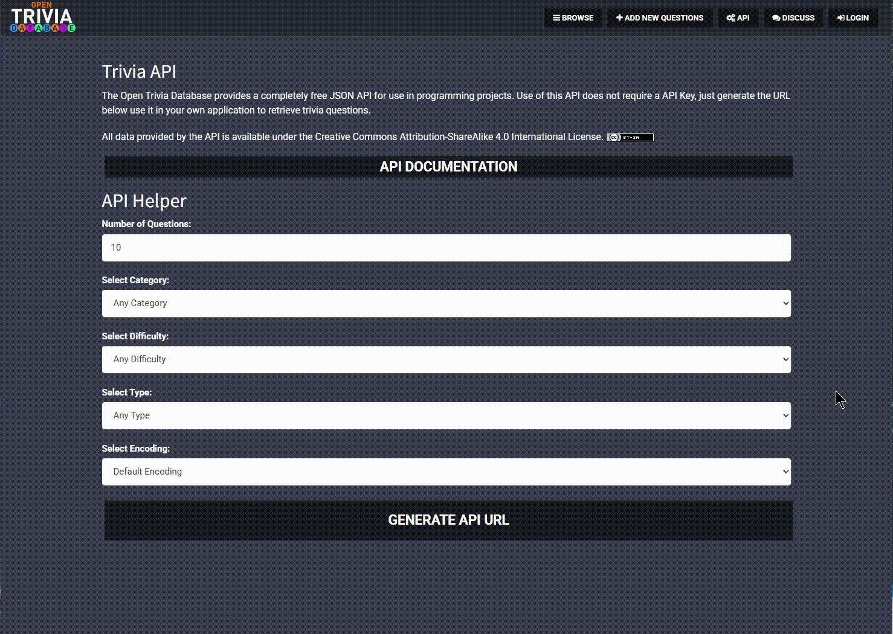

# Quiz Game (using Python & Tkinter)


An interactive, GUI-based quiz game built with Python using the Tkinter GUI toolkit and Pillow for image processing. The game presents True/False trivia questions and tracks the user's score. This project was built as part of my Python development coursework to demonstrate object-oriented programming, event-driven GUI design, and data-driven functionality.

## 📷 Screenshot


## 💡 Features

- GUI built with Tkinter and styled for clarity
- Displays trivia questions dynamically
- Accepts True/False answers via custom image buttons
- Tracks and displays score in real-time
- Automatically shows final score at the end
- Modular design with separate files for logic, data, and UI

## 🛠️ Technologies Used

- Python 3.13
- Tkinter (GUI)
- Pillow 11.1.0 (image handling)

## 📁 Project Structure
```
quiz-game-tkinter/
├── images/
│   ├── true.png
│   └── false.png
├── quiz_brain.py
├── question_model.py
├── data.py
├── main.py
├── README.md
└── requirements.txt
```

## 🚀 Getting Started
Follow the steps below to set up and run the Quiz Game locally.  
📝 **Prerequisites:**
Make sure you have **Python** and **Git** installed. If not, install them here:
- [Python Download](https://www.python.org/downloads/)  
*<small>(Make sure to check “Add Python to PATH” during installation!)</small>*  

- [Git Download](https://git-scm.com/downloads)

### 1. Clone the repository
<small>Open your terminal (Command Prompt, PowerShell, Git Bash, or macOS/Linux Terminal), then run:</small>
```
git clone https://github.com/emh68/quiz-game-tkinter.git
cd quiz-game-tkinter
```
### 2. (Optional but recommended) Create and activate a virtual environment
<small>This keeps dependencies isolated to this project.</small>


 Windows
```
python -m venv venv
venv\Scripts\activate
```
🍎 macOS/🐧Linux
```
python3 -m venv venv
source venv/bin/activate
```

### 3. Install the dependencies
<small>Run the command below. If you get a "pip not found" error, try `python -m pip install -r requirements.txt` instead.</small>

```
pip install -r requirements.txt
```

### 4. Run the application
```
python main.py
```
### Adding More Questions
Click [HERE](https://opentdb.com/api_config.php) then select the number of questions you want, the category type, and difficulty.
- Make sure to select type -> True/False
- In the output you should see ```"type": "boolean"``` if you see ```"type": "multiple"``` you did not select type true/false
<br>
<br>

<small><small>Questions provided by Open Trivia Database</small></small>


### Remove unnecessary text 
Clean up the JSON to include only the question and correct_answer fields, and remove unrelated metadata like response_code, category, difficulty, etc.<br>

**This:**
```json
{
  "response_code": 0,
  "results": [
    {
      "type": "boolean",
      "difficulty": "easy",
      "category": "Animals",
      "question": "In 2016, the IUCN reclassified the status of Giant Pandas from endangered to vulnerable.",
      "correct_answer": "True",
      "incorrect_answers": [
        "False"
      ]
    },
    {
      "type": "boolean",
      "difficulty": "medium",
      "category": "Science &amp; Nature",
      "question": "Male pandas do handstands while urinating on trees. ",
      "correct_answer": "True",
      "incorrect_answers": [
        "False"
      ]
```
**Should look like this:**
```python
question_data = [
    {"question": "In 2016, the IUCN reclassified the status of Giant Pandas from endangered to vulnerable.","correct_answer": "True"},
    {"question": "Male pandas do handstands while urinating on trees. ","correct_answer": "True"}
]
```
## 🔗 Links

- [View the GitHub repo](https://github.com/emh68/quiz-game-tkinter)
- [More of my projects](https://github.com/emh68)
- [Connect on LinkedIn](https://www.linkedin.com/in/elihansen1/)

## 📜 License

This project is open for educational and personal use. See the [LICENSE](LICENSE.txt) file for details.